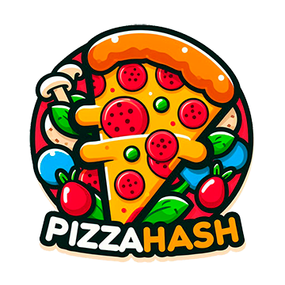
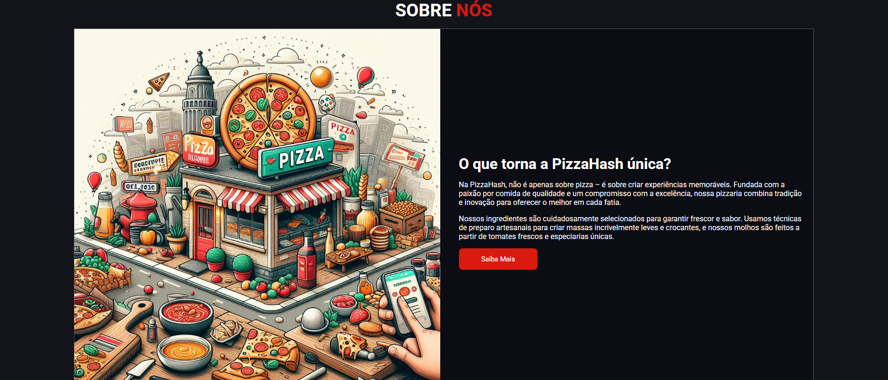
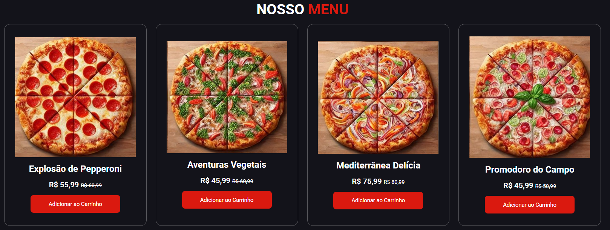
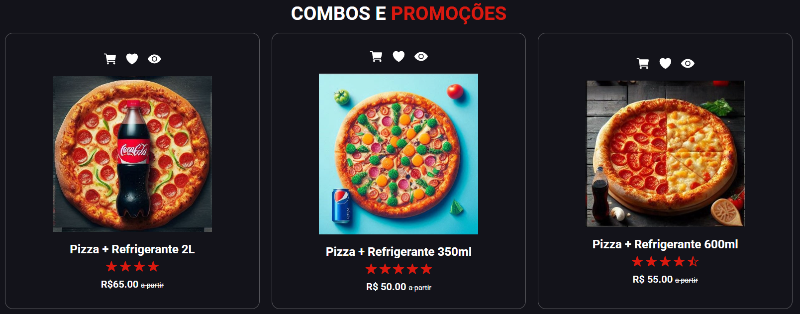
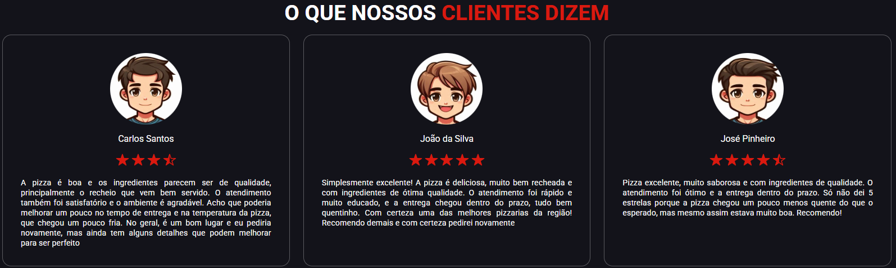

# 🍕 PizzaHash — Landing Page


Landing page moderna e responsiva criada para demonstrar o site de uma pizzaria fictícia chamada **PizzaHash**.  
Este projeto foi desenvolvido com foco em portfólio, destacando habilidades em HTML, CSS e construção de layout organizado e semântico.

---

## 🔗 Demo

👉 **Acesse o projeto online:**  
https://itsmemaikon.github.io/PizzaHash/

---

## 📸 Screenshots

| Home |
|------|
|  |

| Sobre |
|------|
|  |

| Menu |
|------|
|  |

| Promoções |
|-----------|
|  |

| Avaliações |
|------------|
|  |

---

## 🧱 Tecnologias Utilizadas

- **HTML5** — Estrutura semântica  
- **CSS3** — Layout, responsividade e estilização  
- **Ionicons** — Ícones via CDN  

---

## 📂 Estrutura do Projeto

```
pizza-hash-landing/
├─ index.html
├─ style.css
├─ /images
│   ├─ cliente_1.jpg
│   ├─ cliente_2.jpg
│   ├─ cliente_3.jpg
│   ├─ home.jpg
│   ├─ logo.jpg
│   ├─ pizza_item_1.jpg
│   ├─ pizza_item_2.jpg
│   ├─ pizza_item_3.jpg
│   ├─ pizza_item_4.jpg
│   ├─ pizza_item_5.jpg
│   ├─ pizza_item_6.jpg
│   ├─ promo_1.jpg
│   ├─ promo_2.jpg
│   ├─ promo_3.jpg
│   ├─ sobre.jpg
├─ /screenshots
│   ├─ home.png
│   ├─ menu.png
│   ├─ promocoes.png
│   └─ avaliacoes.png
└─ README.md
```

---

## 🚀 Como Rodar Localmente

### ✔️ Abrir diretamente
Basta abrir o arquivo `index.html` no navegador.

### ✔️ Usar servidor local com Node (opcional)

```bash
npm install -g http-server
http-server . -p 8000
```

Acesse:  
http://localhost:8000

---

## 📌 Conteúdo da Página

- **Header fixo** com navegação e ícones  
- **Seção Home** com chamada para ação  
- **Seção Sobre** contando a história da pizzaria  
- **Menu de Pizzas** com cards e preços  
- **Combos e Promoções** com cards preços  
- **Avaliações de Clientes** com fotos e estrelas  
- **Rodapé completo** com links úteis e redes sociais  
- **Design responsivo básico**

---

## 🧩 Possíveis Melhorias Futuras

- [ ] Implementar menu mobile funcional  
- [ ] Criar carrinho simples usando JavaScript  
- [ ] Transformar em projeto React (com Vite)  
- [ ] Criar API fake (JSON) para produtos e avaliações  

---

## 🤝 Como Contribuir

1. Faça um fork  
2. Crie uma branch:  
   `git checkout -b feature/nova-feature`
3. Commit:  
   `git commit -m "feat: nova funcionalidade"`
4. Push:  
   `git push origin feature/nova-feature`
5. Abra um Pull Request

---

## 📄 Licença

Projeto licenciado sob a **MIT License**.  
Sinta-se à vontade para usar, modificar e compartilhar.
